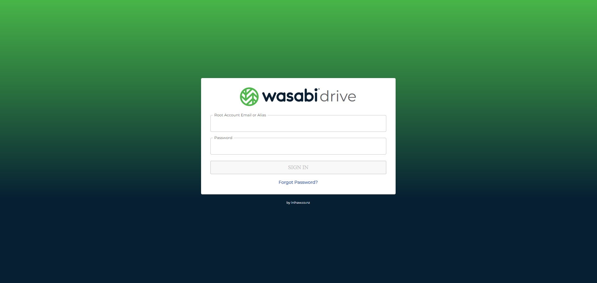
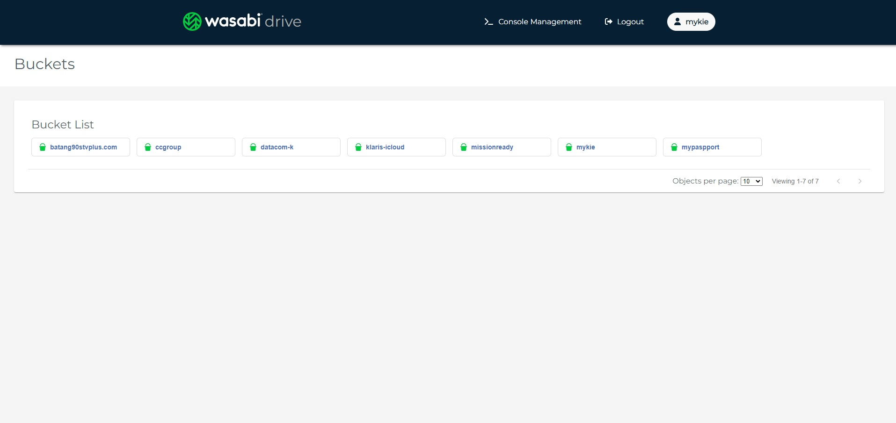
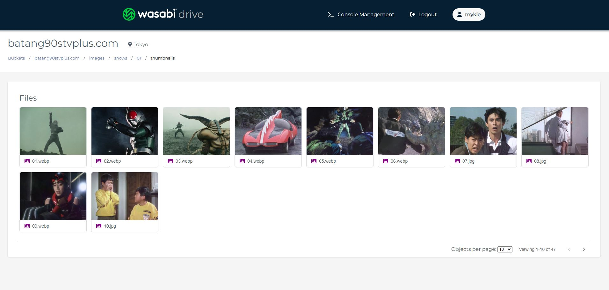

# Wasabi Drive Web Application

This project was bootstrapped with [Create React App](https://github.com/facebook/create-react-app).

View objects from a [Wasabi](https://wasabi.com/) Cloud Storage.

## Frontend test deployment

The Firebase project alias `test` points to `wasabi-drive-test`, with the
canonical Hosting origin `https://wasabi-drive-test.web.app`. Firebase Hosting
uses the repository-local `firebase-tools` npm package, so a global Firebase
CLI installation is not required.

Before running `npm run deploy:test`, configure these values with the test
environment configuration:

- `REACT_APP_API_URL` — the existing backend test API Gateway base URL;
- `REACT_APP_ENTRA_TENANT_ID`;
- `REACT_APP_ENTRA_CLIENT_ID`;
- `REACT_APP_ENTRA_API_SCOPE`.

Create React App embeds `REACT_APP_*` values into the static JavaScript during
`npm run build`. Firebase Hosting does not replace them after the build, so
the test values must be present before deployment starts. Test and production
must be built separately; do not reuse a test build for production.

These values are browser-visible configuration, not secrets. Do not put client
secrets, API keys, or other credentials in frontend environment variables.

The MSAL redirect and post-logout redirect are derived from
`window.location.origin` with a trailing slash. For the test site, register
`https://wasabi-drive-test.web.app/` as a Single-page application (SPA) redirect
URI in the existing Microsoft Entra application registration.

Deploy the test build with:

```bash
npm run deploy:test
```

## Production deployment

Configure the production `REACT_APP_*` values before building and deploy with
the existing, separate production command:

```bash
npm run deploy:prd
```

## Screenshots

Login page:


Home page:


Objects page:
